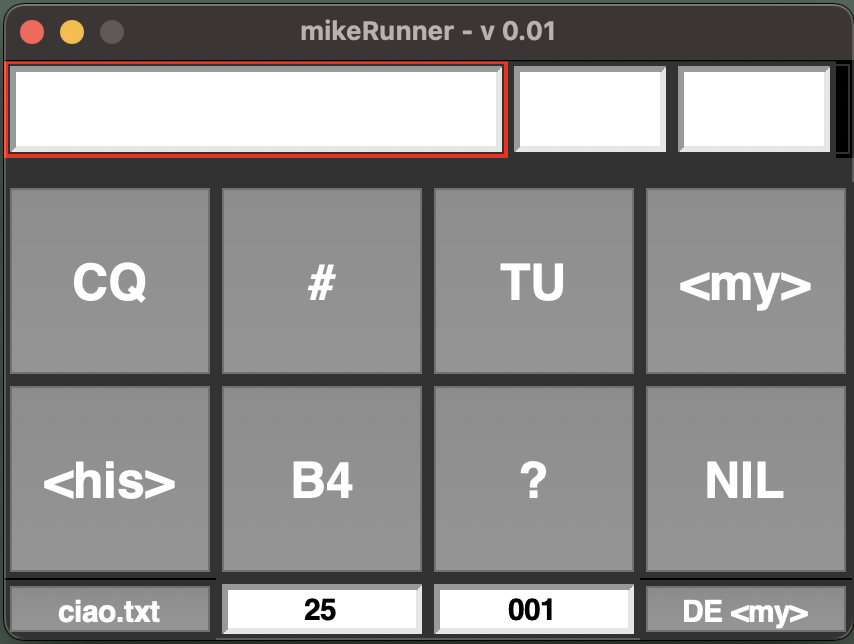
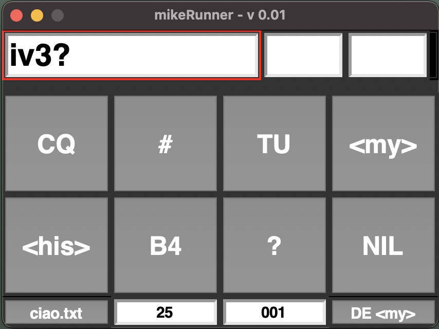
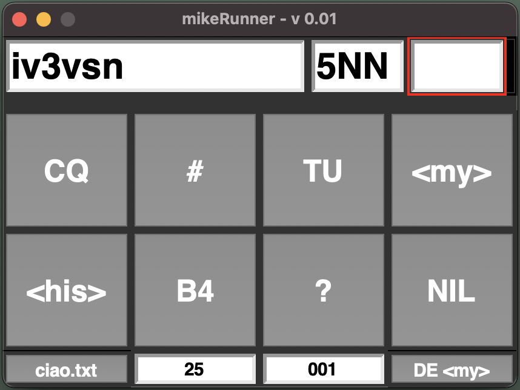
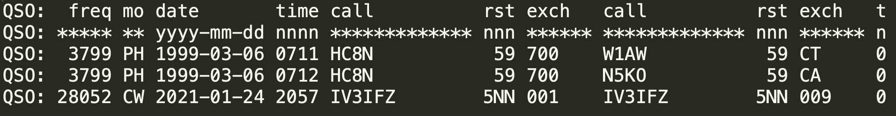

# CW over CAT for Kenwood TS590SG (GUI with Tkinker)

## Installation

You must first copy mgiugliano/CWviaCAT/CommandLineVersion/CWvCAT.py to the current working directory.

## This is still work in progress

If you are familiar with MorseRunner, you should be able to intuitively get around.

## Screenshots

